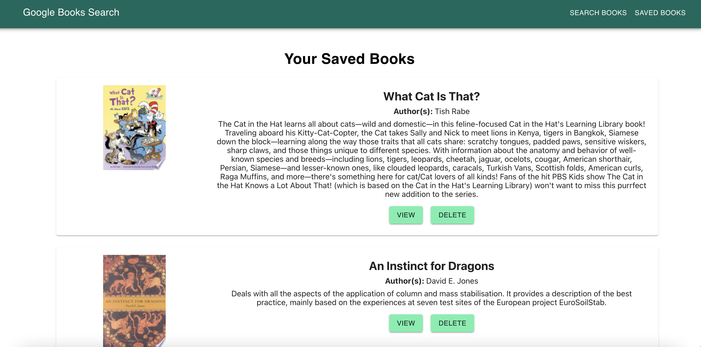
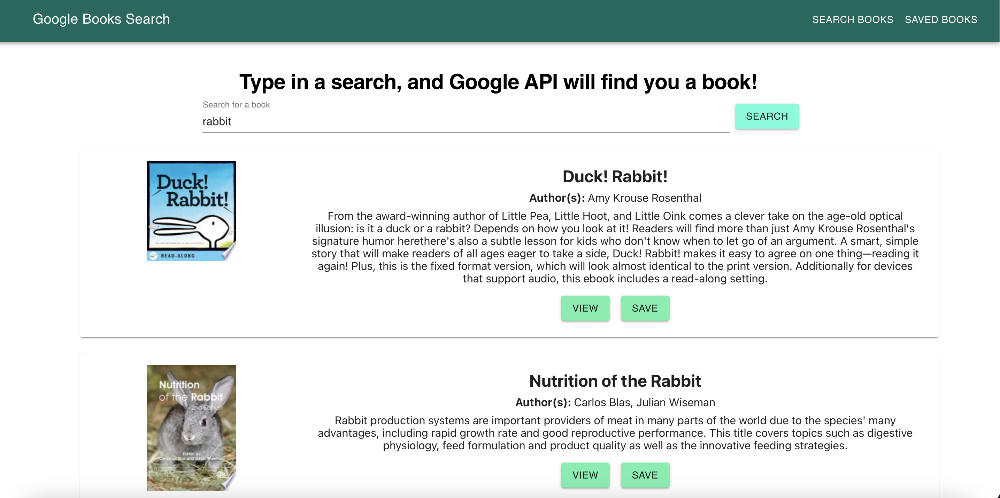

# Google Book Search

> Have you ever known what you wanted to read about, but couldn't find a perfect book for your preferred subject? The Google Book Search application utilizes the Google Books API to allow users to type in a search and be presented with books. If users are interested in a book they find, they can open it on Google Books for more information, or save it to a list of favorite books.
## Table of Contents

* [Description](#description)
* [Screenshots](#screenshots)
* [License](#license)
* [Questions](#questions)

## Description

The Google Book Search app allows a user to type in a search value, and then they are presented with a list of books that match the search value provided. If a user likes the book, they can click on the "View" button to view more about the book on the Google Books website, or the "Save" button to save it to a list of favorites. When users click on the tab for "Saved Books", they can access their list of saved favorites, view the books on Google Books, or delete a book from their list of favorites. This application uses Node.js, React.js, MongoDB, Mongoose, Express, Axios, Nodemon, and Material-UI CSS Framework to function.

## Screenshots

Searching for Books

Viewing Saved Books

## License

Copyright 2020 Maria Waslick

Permission is hereby granted, free of charge, to any person obtaining a copy of this software and associated documentation files (the "Software"), to deal in the Software without restriction, including without limitation the rights to use, copy, modify, merge, publish, distribute, sublicense, and/or sell copies of the Software, and to permit persons to whom the Software is furnished to do so, subject to the following conditions:

The above copyright notice and this permission notice shall be included in all copies or substantial portions of the Software.

THE SOFTWARE IS PROVIDED "AS IS", WITHOUT WARRANTY OF ANY KIND, EXPRESS OR IMPLIED, INCLUDING BUT NOT LIMITED TO THE WARRANTIES OF MERCHANTABILITY, FITNESS FOR A PARTICULAR PURPOSE AND NONINFRINGEMENT. IN NO EVENT SHALL THE AUTHORS OR COPYRIGHT HOLDERS BE LIABLE FOR ANY CLAIM, DAMAGES OR OTHER LIABILITY, WHETHER IN AN ACTION OF CONTRACT, TORT OR OTHERWISE, ARISING FROM, OUT OF OR IN CONNECTION WITH THE SOFTWARE OR THE USE OR OTHER DEALINGS IN THE SOFTWARE.

## Questions

If you have additional questions, you can contact me through my [GitHub Profile](https://github.com/mwaslick), or e-mail me at mariawaslick@gmail.com.

